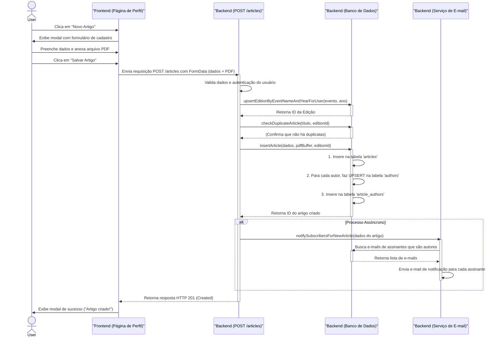

# Diagrama de Sequência: Publicação de um Artigo

Este documento descreve o fluxo de interação entre o frontend, backend e banco de dados durante o processo de publicação de um novo artigo no sistema.

## Lógica do Processo

O processo se inicia na página de perfil do usuário, onde ele aciona um formulário para o cadastro de um novo artigo. O frontend coleta os dados (título, autores, evento, ano, etc.) e o arquivo PDF, empacota tudo em um objeto `FormData` e envia para o backend.

O backend, na rota `POST /articles`, executa as seguintes ações em ordem:
1.  **Autenticação**: Verifica se o usuário está logado.
2.  **Validação**: Confere se os campos obrigatórios foram preenchidos.
3.  **Criação de Entidades**: Garante que o Evento e a Edição existam para aquele usuário, criando-os se necessário (`upsert`).
4.  **Verificação de Duplicidade**: Checa se já não existe um artigo com o mesmo título naquela edição.
5.  **Inserção no Banco**:
    *   Salva os metadados do artigo e o conteúdo do PDF na tabela `articles`.
    *   Para cada autor informado, verifica se ele já existe na tabela `authors` e o cria se necessário (`upsert`).
    *   Cria as associações na tabela `article_authors`.
6.  **Notificação**: De forma assíncrona (sem atrasar a resposta ao usuário), dispara um processo que verifica se algum dos autores é um assinante do sistema e, em caso positivo, envia um e-mail de notificação.
7.  **Resposta**: Envia uma resposta de sucesso (`201 Created`) para o frontend, que por sua vez informa o usuário que a publicação foi bem-sucedida.

## Diagrama UML

