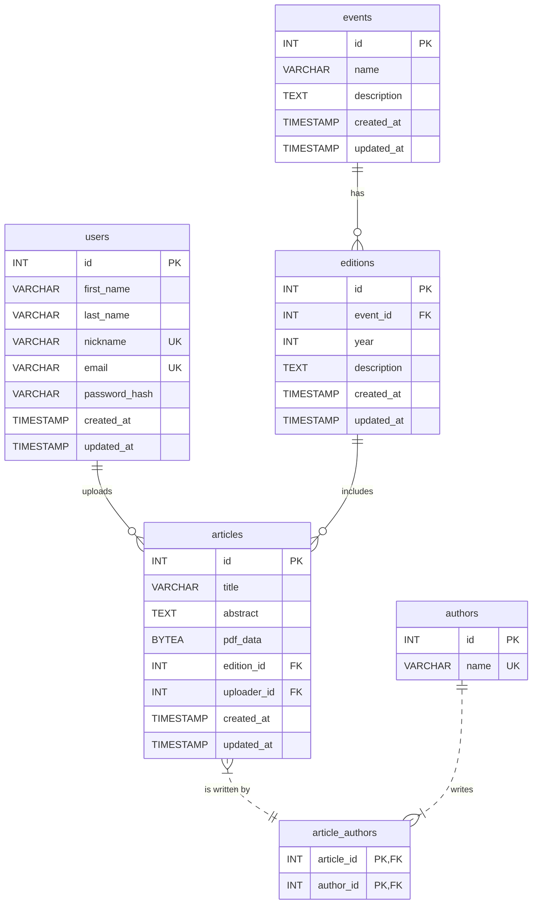

# TP1 - Biblioteca Digital de Artigos

Esse repositório contém o tp 1 da disciplina de engenharia de software, que consiste em implementaruma biblioteca digital de artigos, trabalhando em time utilizando a metodologia ágil SCRUM.

---

## 👥 Equipe

| Nome                 | Papel      | GitHub |
|----------------------|------------|--------|
| Gustavo Luiz    | Frontend  | [@Gustavo](https://github.com/Gustav0Luiz) |
| Leonardo Romano | Backend    | [@LeoRoms](https://github.com/LeoRoms) |
| Vinicius de Alcantara| Backend - banco de dados  | [@vini-alg](https://github.com/vini-alg) |
| Arthur Guimarães  | Backend    | [@Arthur](https://github.com/arthurguimaraesferreira) |

---
## 🛠 Tecnologias Utilizadas

### Frontend
- **Frameworks:** Next.js  
- **Bibliotecas:** ReactJS, TailwindCSS 

### Backend
- **Frameworks:** Express.js  
- **Bibliotecas:** Node.js,  

### Banco de Dados
- **SGBD:** PostgreSQL  

### Agente de IA 
- Cursor/Windsurf

### Outras Ferramentas
- **Controle de versão:** Git + GitHub  
- **Gerenciamento de dependências:** npm    
---

## Esquema do Banco de Dados

A estrutura do banco de dados foi projetada para suportar as funcionalidades da aplicação, incluindo o gerenciamento de eventos, artigos, autores e usuários. Abaixo está o Diagrama de Entidade-Relacionamento (ERD) que representa as tabelas e suas conexões.




## 🚀 Como Executar o Projeto

### Pré-requisitos
- Node.js (versão 18 ou superior)
- PostgreSQL
- npm


O backend estará rodando em: `http://localhost:4000`

O frontend estará rodando em: `http://localhost:3000`

### 4. Testar as Conexões

Acesse `http://localhost:3000/test-connection` para verificar se:
- ✅ Frontend está se comunicando com o Backend
- ✅ Backend está conectado ao Banco de Dados
- ✅ API está funcionando corretamente

### 5. Ordem de Execução

**Execute nesta ordem:**

1. **Banco de dados primeiro:**
   ```bash
   sudo systemctl start postgresql
   ```

2. **Backend em segundo:**
   ```bash
   cd backend && npm run dev
   ```

3. **Frontend por último:**
   ```bash
   cd frontend && npm run dev
   ```

### 📁 Estrutura do Projeto

```
tpes2/
├── backend/           # API Express.js
│   ├── src/
│   │   ├── routes/    # Rotas da API
│   │   └── index.js   # Servidor principal
│   ├── .env           # Variáveis de ambiente
│   └── package.json
├── frontend/          # Aplicação Next.js
│   ├── src/
│   │   ├── app/       # Páginas e componentes
│   │   └── lib/       # Utilitários (API client)
│   ├── .env           # Variáveis de ambiente
│   └── package.json
└── schema.sql         # Schema do banco de dados
```

### 🔧 Comandos Úteis

```bash
# Parar todos os processos
Ctrl + C (em cada terminal)

# Verificar se o PostgreSQL está rodando
sudo systemctl status postgresql

# Acessar o banco diretamente
psql -U postgres -d vlib

# Ver logs do backend
cd backend && npm run dev

# Buildar para produção
cd frontend && npm run build
cd backend && npm start
```

---


